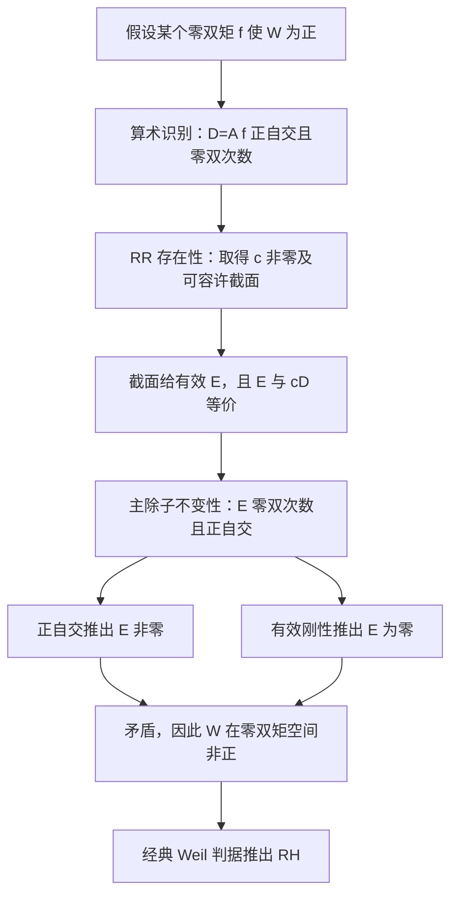

# F₁ 路线究竟要找什么，以及它为什么可能证明黎曼猜想

一份从大学二年级数学出发的说明讲义 · 2026-09-10

本文面向学过微积分、线性代数和初步抽象代数，但未必熟悉代数几何的读者。
复分析只用到几个会现场解释的概念；不要求预先学过层、概形、上同调或 topos。

**主问题：能否找到一种算术几何，使一个由素数确定的二次型成为几何交叉数，
并通过几何中的存在性定理证明它在指定子空间上非正？**

本文详细讨论的是我们项目采用的 F₁／Riemann–Roch 支线。F₁ 有多种理论，
不存在一套已获公认、唯一且完整的“F₁ 公理”自动推出 RH。
文中给出的是一组明确的**充分条件**和条件推理；没有证明满足全部条件的对象已经存在。

## 阅读导航与结论的性质

- 第 1–3 节：RH 为什么会引出几何，F₁ 名字的含义。
- 第 4–6 节：除子、交叉、层、截面这些对象究竟是什么。
- 第 7–8 节：固定算术二次型和连接 RH 的经典定理。
- 第 9–10 节：完整列出所需条件，并逐步证明“条件成立 ⇒ RH”。
- 第 11–13 节：F₁ 几何如何尝试实现条件，以及自由存在性路线。
- 第 14–16 节：当前进度、术语表与文献。

本文使用四种标记：

| 标记 | 含义 |
|---|---|
| **定义** | 精确规定一个符号或对象，不声称它具有尚未证明的性质 |
| **经典定理** | 使用已有数学结论；若不在本文证明，会明确说明 |
| **条件命题** | 给定列出的假设后，本文提供证明 |
| **研究要求** | 希望实际几何满足的条件，尚未在本项目目标对象上证明 |

这些区分尤其适用于第 8 节的 Weil 判据和第 10 节的证明：前者是外部经典桥梁，
后者是可以用线性代数与反证法完整检查的条件推理。

## 1. 黎曼猜想说的是什么

### 1.1 从级数到素数

对复数 s 且 Re(s)>1，定义
\[
\zeta(s)=\sum_{n=1}^{\infty}n^{-s},\qquad n^{-s}=e^{-s\log n}.
\]
唯一素因子分解给出
\[
\zeta(s)=\prod_{p\ \mathrm{prime}}\frac1{1-p^{-s}}.
\]
因为每个因子展开为 `1+p^{-s}+p^{-2s}+…`，相乘时恰好每个正整数出现一次。
在 Re(s)>1 的区域，绝对收敛使这项操作合法。

**经典事实。** ζ 可以唯一延拓为整个复平面上的亚纯函数，在 s=1 有一个简单极点。
“解析延拓”指用与原函数在重叠区域一致的解析表达式，扩展定义域；
不是把原本不收敛的级数仍当作普通级数求和。

它在 -2,-4,-6,… 有平凡零点。其余零点叫非平凡零点，位于
\[
0<\operatorname{Re}s<1.
\]
**黎曼猜想 RH** 断言每个非平凡零点 ρ 都满足 Re(ρ)=1/2。

### 1.2 为什么只知道对称性不够

函数方程提供关于 s 与 1-s 的关系；实系数性质提供复共轭对称性。
因此零点存在相应对称。但关于一条直线对称的点集，显然不必全部落在那条直线上。

需要某种额外约束，排除临界线两边成对出现的零点。F₁ 路线试图让几何提供这种约束。

## 2. 一个已经成功的榜样：有限域上的曲线

### 2.1 有限域和点数

F_p 是模素数 p 的整数所成的域；更一般的有限域 F_q 有 q=p^a 个元素。
在 F_q 上写一个多项式方程，就可以问它在 F_q、F_(q²)、F_(q³)… 上有多少解。

把合适的一维几何对象记作 C，令
\[
N_n=\#C(\mathbb F_{q^n}).
\]
光滑、射影、几何连通是经典定理所需的条件。这里可先将其理解为：
没有奇点、已补齐无穷远处、扩展底域后仍是一整条曲线；严格定义不在本文展开。

把全部点数装入生成函数
\[
Z_C(t)=\exp\left(\sum_{n\ge1}N_n\frac{t^n}{n}\right).
\]

**经典定理。** 对上述曲线，存在 2g 个代数数 α_j，使
\[
Z_C(t)=\frac{\prod_{j=1}^{2g}(1-\alpha_jt)}{(1-t)(1-qt)},
\qquad |\alpha_j|=\sqrt q.
\]
g 叫曲线的亏格，是测量曲线复杂程度的非负整数。
这组陈述是曲线情形的 Weil 理论；背景见 Milne 第 26–27 节。
[作者讲义](https://www.jmilne.org/math/CourseNotes/LEC.pdf)

### 2.2 为什么它也是“黎曼猜想”

代入 t=q^{-s}。如果分子某个因子为零，则 α_jq^{-s}=1。取绝对值：
\[
1=|\alpha_j|q^{-\operatorname{Re}s}
=q^{1/2-\operatorname{Re}s},
\]
所以 Re(s)=1/2。这一步只需要指数运算。

比较 \(\log Z_C(t)\) 的系数还得到
\[
N_n=1+q^n-\sum_j\alpha_j^n.
\]
如果把 α_j 看成矩阵 F 的特征值，那么最后一项就是 Tr(F^n)。
曲线的计数误差于是变成了一个线性算子的迹。

### 2.3 几何在哪里发挥作用

在有限域上，取 q 次幂的 Frobenius 映射把坐标送到其 q 次幂。
它的第 n 次迭代的不动点与 F_(q^n) 上的点有关。
几何还构造出保存曲线全局信息的线性空间，即上同调；在合适的 Frobenius 约定下，
上述 α_j 是其一阶部分上的特征值。

这里有两件不同的工作：一是构造出算子并证明迹公式；二是证明特征值具有正确大小。
单独得到一个矩阵、一个函数方程或互反配对，均不足以推出第二件事。
F₁ 路线希望在整数情形找到能完成这两项工作的几何，尤其是提供符号约束的部分。

## 3. “一元素域”为什么不是一个普通域

### 3.1 整数已经像一条曲线

整数对应的空间叫 Spec Z。读本文时，可把它记成一个由素数组织起来的算术空间：
每个素数 p 对应一个闭点，那个点的剩余域是 F_p；另有一个与 Q 对应的泛点。
它的拓扑不是离散拓扑，所以不能简单视为“互不联系的素数列表”。

普通代数曲线 C 定义在共同底域 k 上。整数的不同素数点却有不同特征，
没有一个通常意义的域能以同样方式充当所有这些有限域的共同底域。
这推动了“更基础的几何基底”的设想，F₁ 是这类设想的名称。

### 3.2 不能把 q=1 机械代入

普通域必须满足 0≠1，所以只有一个元素的普通域不存在。
F₁ 理论会改变底层结构语言，例如保留乘法、放宽加法，或记录额外的 Frobenius 数据。
把有限域公式里的 q 改成 1，至多提供启发，不会自动构造出任何空间。
特别是 t=q^{-s} 在 q=1 时失去关于 s 的信息，不能用这一代换证明通常 RH。

### 3.3 一个能算出来的例子：热带半环

在 R∪{-∞} 上定义
\[
a\oplus b=\max(a,b),\qquad a\odot b=a+b.
\]
其中 -∞ 是加法零元，普通数 0 是乘法单位元。例如
\[
2\oplus3=3,\qquad 2\odot3=5,\qquad a\oplus a=a.
\]
这样的结构叫半环：有两种运算及分配律，但不要求每个元素都有加法逆元。
不能因为记号里出现“特征一”，就把它当成普通特征为 1 的域。

在这种语言中，许多几何函数变成分段线性函数，乘法变成斜率和位置的运算。
它保留了部分零点信息，但丢失的相位、加法与全局粘合信息必须另行处理。

F₁ 的主要候选语言包括幺半群几何、blueprint、Λ-环和算术 site 等；
本文后面采用的充分条件，并不声称这些理论已经彼此等价。

## 4. 第一个需要理解的对象：除子

### 4.1 除子是带符号的几何计数

在一条曲线上，除子可先理解为有限形式和
\[
D=\sum_P n_P[P],\qquad n_P\in\mathbb Z.
\]
它记录哪些点出现了多少次；“形式和”意味着暂时不把它当成一个普通数。
若所有 n_P≥0，称为有效除子。系数全部为零时得到零除子。

在曲面上，除子通常由曲线而非点组成。例如 D=2C₁-C₂。
在我们最后的条件包里，还允许实系数或连续权重，因此必须说明如何从经典除子
进入实线性空间。这是研究要求，不能由记号自动完成。

### 4.2 函数的零点减去极点：主除子

亚纯函数可以有零点和极点。在局部坐标 z 附近，
若 f(z)=(z-a)^m u(z)，其中 u 在 a 附近不为零，则 a 的阶数为 m；m<0 表示极点。

把复平面补上无穷远点得到 P¹(C)，也叫黎曼球面。对不同的有限点 a,b，
\[
\operatorname{div}\left(\frac{z-a}{z-b}\right)=[a]-[b].
\]
这种来自全局函数的除子称为主除子。若 D-E 是主除子，就称 D 与 E 线性等价，记 D~E。
例如球面上的 [a]~[b]：位置不同，但差可以由一个函数解释。

球面上的非零有理函数总零点数等于总极点数，均计重数并包含无穷远点。
例如 div(z-a)=[a]-[∞]；漏掉 ∞ 就会算错次数。
所以主除子的总次数为零，线性等价保留次数。

### 4.3 “局部主”不等于“全局主”

一个除子可能在每个小区域里都由某个函数描述，但这些函数不一定来自同一个全局函数。
它们在重叠处可以相差一个处处不为零的因子。这个差别正是线丛和层需要记录的信息。

具体地，若局部定义函数为 g_i，在重叠处 g_i/g_j 必须可逆；这些比值还满足
`(g_i/g_j)(g_j/g_k)=g_i/g_k`。它们记录局部坐标如何转换。
线丛的局部截面也按指定的可逆因子转换，而不是在所有区域上直接等于同一个函数。

因此，不能把“每个地方都能写方程”升级成“全局存在一个统一函数”。
我们的条件包专门区分了局部主除子映射与全局主除子子空间。

## 5. 第二个对象：平方、对应和交叉配对

### 5.1 为什么考虑平方

对曲线 C，乘积 C×C 是一个曲面。映射 F:C→C 的图像
\[
\Gamma_F=\{(x,F(x)):x\in C\}
\]
和对角线
\[
\Delta=\{(x,x):x\in C\}
\]
相交，恰好表示 F(x)=x。因此，数不动点可以转成数交点。

更一般的“对应”是 C×C 中同时联系两边的几何对象，不必是单值函数的图像。
它可以多值，两个投影也可能有不同次数。把对应复合、取转置，分别类似关系的复合、
交换输入输出；严格操作还包含几何结构与重数。

### 5.2 交叉数不是简单的集合交集大小

两条不同曲线适当地相交时，交叉数会计入相切重数。
自交 D·D 则不能解释为“数 D 与自己共有多少点”；它需要通过等价类、变形等方式定义。
因此自交可以为负，不与“点数非负”矛盾。

在合适的除子空间 V 上，交叉数写成对称双线性配对
\[
B:V\times V\to\mathbb R.
\]
选有限个基后，它就是对称矩阵 Q：B(v,w)=vᵀQw。
但真实除子空间未必有限维，配对也未必正定。

### 5.3 一个具体矩阵例子

在 P¹×P¹ 中，取两种纤维
\[
H=\{a\}\times\mathbb P^1,\qquad
V=\mathbb P^1\times\{b\}.
\]
经典交叉规则为
\[
H^2=V^2=0,\quad H\cdot V=1,
\qquad Q=\begin{pmatrix}0&1\\1&0\end{pmatrix}.
\]
纤维自交为零可由移到另一条不相交的等价纤维理解。
若 D=aH+bV，则 D²=2ab。因此 H+V 自交为 2，H-V 自交为 -2。

两个方向的次数可以由 D·H=b、D·V=a 检测。
在这个简单例子中，零双次数只留下零数值类；更一般的曲线平方可以有额外方向。
不能把这个二维例子当成 ζ 所需空间的完整模型。

### 5.4 正性结构也可能表现为非正性

线性代数中的半正定性写为 vᵀQv≥0；正定性还要求非零 v 处严格大于零。
几何交叉配对则可以有一个正方向及其他负方向。
经典 Hodge 指数定理就是控制这种符号的工具之一。
我们采用的 RH 判据只要求对 D=A(f)、f∈T₀ 的算术对应有 B(D,D)≤0。
这些 D 都是零双次数，但未必遍历全部零双次数除子。
在整个零双次数空间证明非正当然也足够，不过那是更强的要求；也不要求整个 B 负半定。

## 6. 第三个对象：层、截面与存在性

### 6.1 层是“局部数据及其粘合规则”

在一个空间的每个开区域 U 上，考虑连续函数集合 O(U)。它带有两种基本机制：

1. 若 W⊂U，函数可以限制到 W；连续限制两次等于一次限制。
2. 若一族开集覆盖 U，各小区域的函数在重叠处相同，则能唯一粘成 U 上的函数。

把“连续函数”换成解析函数、除子、某种代数数据，保留限制与唯一粘合的要求，
就得到层这一概念。层不是一张只列出各处数据、却没有相容映射的表。

site 进一步允许用抽象对象和态射表达“区域与覆盖”；topos 是这些层所成的范畴。
这里“范畴”可理解为对象、它们之间的映射，以及满足结合律的映射复合。
它们让几何不必先是一个熟悉的点集，但仍有精确的局部到全局规则。

### 6.2 截面可以先理解为满足局部约束的全局函数

在光滑完整曲线上，对整数除子 D，可定义
\[
H^0(D)=\{0\}\cup\{f\text{ 为非零亚纯函数}:\operatorname{div}f+D\ge0\}.
\]
这里 ≥0 表示有效性。给定 D 相当于规定允许哪些极点，以及要求哪些零点。
这个空间也可解释为某个线丛的全局截面空间。

球面上取 D=k[∞]，k≥0。不能有有限极点，且无穷远极点阶数不超过 k，
因此 H⁰(D) 恰好是次数不超过 k 的多项式加零函数，维数为 k+1。
这是一个可以直接用多项式检查的截面例子。

### 6.3 截面怎样给出有效代表

上面的非零 f 给出
\[
E=\operatorname{div}f+D\ge0,\qquad E\sim D.
\]
所以“存在非零截面”可以转换为“这个等价类里有有效代表”。
不过 E 可能为零：例如 D=0、f=1，就得到 E=0。

在更一般的几何里，非零截面还未必能定义有效 Cartier 除子。
因此本文使用 **Adm(D)** 表示可取除子的可容许截面子集，并要求
\[
\operatorname{Adm}(D)\subseteq H^0(D)\setminus\{0\}.
\]
普通 Cartier 理论中的正则截面条件是它的一种实现；在 F₁／广义实除子情形，
可容许性必须从具体几何定义并证明。

### 6.4 Riemann–Roch 为什么是一种存在性工具

不必写出一个具体多项式，也能由 dim H⁰(D)>0 知道有非零截面。
Riemann–Roch 是把这种维数与次数、交叉数等几何量联系起来的定理族。

**经典定理。** 复光滑完整曲线上，适当定义典范除子 K 后，有
\[
\ell(D)-\ell(K-D)=\deg D+1-g,\qquad \ell(D)=\dim H^0(D).
\]
因此右边为正时，利用 ℓ(K-D)≥0 可推出 ℓ(D)>0。
本文不证明这条经典定理，也不要求读者先掌握 K 的完整构造。

曲面版本会出现自交这样的二次项。但“有一个 RR 公式”不自动等于“有需要的截面”：
还需控制其他上同调项、边界和可容许性。
目标不是照抄经典公式，而是在实际算术对象上证明第 9 节列出的具体存在性结论。

## 7. 算术端：先固定一个真正属于 ζ 的二次型

前面的几何还没有接上素数。下面的定义把算术任务固定下来。

### 7.1 测试函数及两个矩

令
\[
\mathcal T=C_c^\infty(\mathbb R,\mathbb R).
\]
它表示实值、任意阶可微、紧支集函数。紧支集意味着：对某个 R>0，|x|>R 时 f(x)=0。
这些函数像形状可调的探针；量词包括所有这种探针，不只某个有限参数族。

定义
\[
d(f)=\int_{\mathbb R}e^xf(x)\,dx,
\qquad d'(f)=\int_{\mathbb R}f(x)\,dx,
\]
以及
\[
\mathcal T_0=\{f\in\mathcal T:d(f)=d'(f)=0\}.
\]
这是两个线性约束，不是说 f 逐点为零。事实上它包含许多非零函数。

例如可取 |x|<1 时 φ(x)=exp(-1/(1-x²))，其余地方 φ(x)=0。
这个非零“光滑小山包”在边界的所有阶导数都为零。
令 f=φ''+φ'。分部积分给出
\[
\int f=0,\qquad
\int e^x\phi''=\int e^x\phi,\qquad
\int e^x\phi'=-\int e^x\phi,
\]
故 f∈T₀。若 f=0，则 φ''+φ'=0 的通解为 a+be^{-x}，紧支集迫使 a=b=0，
与选择矛盾。这说明零双矩测试类并非空洞。

### 7.2 反射与卷积

定义加权反射
\[
f^\sharp(x)=e^{-x}f(-x),
\]
以及卷积
\[
(f*g)(x)=\int_{\mathbb R}f(t)g(x-t)\,dt.
\]
卷积把两个函数在所有平移下的重叠累加起来。
这里的指数权不能省略；它来自乘法坐标 u>0 与对数坐标 x=log u 的正规化。

令 h_f=f*f♯。它仍然光滑且紧支集，并且 f↦h_f 是二次的。
直接换元可检查 `(f♯)♯=f`，以及 h_f♯=h_f。

### 7.3 素数和无穷位的具体公式

对光滑紧支集 h，定义
\[
\begin{aligned}
N(h)={}&\sum_{p\ \mathrm{prime}}\sum_{k\ge1}(\log p)\,h(k\log p)\\
&+\int_0^\infty
\frac{e^{2x}h(x)-h(0)}{e^{2x}-1}\,dx
+\frac{\log\pi+\gamma}{2}h(0),
\end{aligned}
\tag{7.1}
\]
其中 γ=lim_(n→∞)(1+1/2+…+1/n-log n) 是 Euler 常数。

最后定义
\[
\boxed{W(f)=N(f*f^\sharp).}
\tag{7.2}
\]
素数幂 p^k 的权重是 log p，不是 log(p^k)。
积分与常数项编码无穷位的贡献；“无穷位”在这里可以理解为通常实／复绝对值
带来的解析部分。它与有限素数贡献共同属于完整显式公式，不能丢掉。
这些正规化与本项目 [Weil.lean](../formal/F1/Analysis/Weil.lean) 一致。

### 7.4 这些式子不是形式发散和

若 supp(h)⊂[-R,R]，则第一项只有 p^k≤e^R 时可能非零，因而实际是有限和。
当 x→0⁺，Taylor 展开给出
\[
\frac{e^{2x}h(x)-h(0)}{e^{2x}-1}
\longrightarrow h(0)+\tfrac12h'(0).
\]
分子中的减项抵消了分母的零点。
当 x>R 时，积分被积函数为 -h(0)/(e^{2x}-1)，指数衰减。
所以对这个测试类，各项的收敛可以严格证明。

Lean 中相应经典分析证明仍待补齐；本文的展开说明了它为何是常规收敛问题，
但不把这段文字当成已有 Lean 证明。

N 是线性的，W 是实二次型。它对应的对称混合配对由极化给出：
\[
W_{\rm pol}(f,g)=\frac12\{W(f+g)-W(f)-W(g)\}.
\]
不要未经证明把单边的 N(f*g♯) 当成对称配对。

## 8. 算术二次型为什么决定零点位置

### 8.1 精确使用的经典桥梁

**经典 Weil 判据，以本讲义的正规化表示：**
\[
\boxed{
\mathrm{RH}\quad\Longleftrightarrow\quad
\forall f\in\mathcal T_0,\ W(f)\le0.
}
\tag{8.1}
\]
它是一个已经存在的分析定理，不是本项目新增的几何假设。
本讲义使用它，不试图用二年级数学重证其全部分析内容。
原文路线定位为 Connes–Consani 2018 §3.1 的式 (12)–(13)。
[固定版本](https://arxiv.org/abs/1805.10501v1)

### 8.2 为什么这样的判据是合理的

考虑变换
\[
F(s)=\int_{\mathbb R}f(x)e^{sx}\,dx.
\]
它是对数坐标下的 Mellin／双边 Laplace 变换。两个零矩条件恰好是 F(0)=F(1)=0。
复分析的显式公式把素数端的表达式与非平凡零点处的 F 值联系起来。

在临界线上，ρ=1/2+iγ 时，1-ρ 就是 ρ 的复共轭；由于 f 实值，
\[
F(1-\rho)=\overline{F(\rho)},\qquad
F(\rho)F(1-\rho)=|F(\rho)|^2\ge0.
\]
这说明为什么“零点位于临界线”能够产生一个确定符号的二次型。
本讲义使用的 W 取相应的非正号约定。

反方向更难：需要证明测试函数足够丰富，若有离线零点，就能检测到符号失败，
并控制其余零点与无穷求和。这正是经典判据的实质，不能只凭上面的共轭计算得到。
后面的几何任务是证明式 (8.1) 右边，从而调用其反方向。

### 8.3 没有要求先把全部零点塞进一个有限矩阵

有限域曲线有有限维上同调，因此 Frobenius 特征值列表有限。
但把其 ζ 函数写成 s 坐标后，q^{-s} 有虚周期 2πi/log q，
同一个特征值也会对应周期性重复的零点；不能把它与通常 ζ 的差别说成“有限个零点对无限个零点”。
通常 ζ 的无限零点尚未由这种固定有限列表加周期性给出。
数域路线可能涉及无限维空间、分布或正规化迹。
本讲义选用交叉／RR 判据，是因为它把所需结论精确表达为 W 的符号，
不要求在起点就提供一个已经实现全部零点的自伴算子。

## 9. 核心条件包：究竟要构造或证明存在什么

下面先给出足够推导 RH 的精确接口，再说明它们要有什么几何来源。
所有符号的量词都属于同一个结构包，不能为不同 f 分别更换几何空间或交叉配对。

### 9.1 需要的数据

寻找
\[
\mathfrak G=(Q,\mathcal O,\mathcal D,\mathcal L,
 V,P,\mathrm{Eff},\deg,\operatorname{codeg},B,A,\operatorname{Adm},Z,\ldots).
\]
这里的 Q 是几何空间／site 的简写，并非有理数域 Q；有理数域使用黑板体 \(\mathbb Q\)。

| 数据 | 精确类型或角色 |
|---|---|
| Q、O | 候选几何及其局部函数结构 |
| D、L | 除子层与按除子索引的截面层 |
| V | 一个实向量空间，识别为指定除子理论的全局对象 |
| P⊂V | 实化后的全局主除子子空间 |
| Eff⊂V | 由几何定义的有效锥 |
| deg、codeg | V→R 的两个线性泛函 |
| B | V×V→R 的对称双线性配对 |
| A | T→V 的实线性映射，将算术探针变成几何对应 |
| Adm(D) | H⁰(D) 中可取除子的非零截面子集 |
| Z_D | 将 Adm(D) 中的截面变为有效代表的映射 |

定义 D~E 当且仅当 D-E∈P。以下条件在适当的全局比较下使用同一个 V；
如果层的全局截面先在另一空间里，必须给出保持这些数据的明确比较映射。

### 9.2 条件 A：精确算术识别

对每个 f∈T，要求
\[
\deg A(f)=d(f),\quad
\operatorname{codeg}A(f)=d'(f),\quad
B(A(f),A(f))=W(f).
\tag{A}
\]
这是把真实素数算术接入几何的地方。量词覆盖全部 T；只匹配若干点或某个有限维
函数族不满足条件 A。几何构造可以变化，但 W 不能随之任意变化。

### 9.3 条件 B：主除子关系保持次数与交叉数

对每个 p∈P、每个 D∈V，要求
\[
\deg p=\operatorname{codeg}p=0,
\qquad B(p,D)=B(D,p)=0.
\tag{B}
\]
“p 位于配对的根空间”就是后面两个等式。
于是 E~D 时，次数相同，且展开 B(D+p,D+p) 可知 B(E,E)=B(D,D)。

这个条件不总能直接搬到任意相对／非紧几何中；边界项可能使它失败。
如果实际构造有修正项，就必须修改配对或等价关系，并重证第 10 节。

### 9.4 条件 C：有效刚性

要求
\[
\forall E\in\mathrm{Eff},\quad
\deg E=\operatorname{codeg}E=0\Longrightarrow E=0.
\tag{C}
\]
它说一个实际非零的有效对象不能同时躲过两个次数的检测。
这是研究要求，不是“有效”一词在逻辑上自动附带的性质。

### 9.5 条件 D：可容许截面产生有效代表

对每个有定义的 D，以及每个 s∈Adm(D)，要求
\[
Z_D(s)\in\mathrm{Eff},\qquad Z_D(s)-D\in P.
\tag{D}
\]
这里并未要求 Z_D(s)≠0；它的非零性会在正自交情形下由条件 B 推出。
截面空间和可容许性都必须来自前面的几何，不能只将一个任意集合命名为 H⁰(D)。

### 9.6 条件 E：RR 型存在性

要求以下量词顺序：
\[
\forall f\in\mathcal T_0,\quad
B(A(f),A(f))>0
\Longrightarrow
\exists c\in\mathbb R\setminus\{0\},\quad
\exists s\in\operatorname{Adm}(cA(f)).
\tag{E}
\]
c 和 s 可以依赖 f；但是 Q、B、A、次数和主等价关系必须在 f 之前统一确定。
允许 c 为负，因而可以取反；允许缩放，是为容纳放大除子后应用存在性定理的策略。
若实际定理给出非零整数倍，当然满足这个实倍数版本。

条件 E 不断言每个零双次数对象都有截面，只处理假设出现正自交的情形。
它仍是一个很强的研究条件；将它写成存在量词不会自动降低难度。

## 10. 完整证明：这些条件为什么足以推出 RH

**条件命题。** 假设存在同一个结构包，满足第 9 节的类型要求及条件 A–E。
再使用经典 Weil 判据 (8.1)，则 RH 成立。

**证明。** 任取 f∈T₀，记 D=A(f)。我们要证明 W(f)≤0。

第一步，反设 W(f)>0。由条件 A，
\[
B(D,D)=W(f)>0,\qquad \deg D=\operatorname{codeg}D=0.
\]

第二步，由条件 E，存在 c≠0 和 s∈Adm(cD)。由条件 D，令
\[
E=Z_{cD}(s)\in\mathrm{Eff},\qquad E-cD\in P.
\]

第三步，由条件 B 和次数线性性，
\[
\deg E=\deg(cD)=c\deg D=0,
\quad
\operatorname{codeg}E=c\operatorname{codeg}D=0.
\]

第四步，写 p=E-cD∈P，展开双线性配对：
\[
\begin{aligned}
B(E,E)
&=B(cD+p,cD+p)\\
&=c^2B(D,D)+cB(D,p)+cB(p,D)+B(p,p)\\
&=c^2B(D,D)>0.
\end{aligned}
\]
最后一行用了条件 B、c≠0 和 B(D,D)>0。
所以 E≠0，因为双线性配对必有 B(0,0)=0。

第五步，E 有效且零双次数，条件 C 却推出 E=0。矛盾。

因此不存在 W(f)>0 的 f∈T₀；也就是对所有 f∈T₀ 有 W(f)≤0。
由经典 Weil 判据得到 RH。证毕。

这就是路线的最终逻辑核心。它很短，是因为困难集中在条件 A–E 的实际实现和证明中。
短的条件推理不表示完整 RH 证明已经接近完成。

## 11. 为什么称为 F₁ 路线：几何实现还需要哪些东西

第 10 节的代数证明没有用到 F₁ 这个名字；只要有满足条件的结构，就足以推出 RH。
F₁ 路线的内容，是尝试用算术几何来**构造这些数据，并给条件提供可证明的原因**。

### 11.1 空间不仅要有点，还要有局部运算

一种可用的几何描述至少要告诉我们：

- 什么是局部区域，什么样的区域族算作覆盖；
- 区域上允许哪些函数或半环元素，它们如何限制；
- 哪些局部数据可以粘成全局数据；
- 两个几何空间之间的态射如何作用于这些数据。

因此“给每个素数指定一个对象”不够。“各处看起来相同”也不等于有自然的全局同构：
比较映射还必须与限制及运算交换。

Connes–Consani 的 arithmetic site 及 reduced square 已有具体定义。
例如平方的底层 topos 可以用带两个相容正整数乘法作用的集合描述，
结构半环与 Newton 凸集相关。这个事实提供了研究起点，但不等于全部交叉和截面理论已完成。
[原论文 Definition 6.22](https://arxiv.org/html/1502.05580v1#S6)

### 11.2 从局部除子到我们使用的 V

需要在实际结构层上定义可逆函数、亚纯函数和除子，证明 div(fg)=div(f)+div(g)，
并使 div 与所有限制映射相容。有效性应能在覆盖上逐块判断，然后粘合。

再说明如何得到条件包中的实线性空间 V。这里可能有三次不同操作：
先形成整数除子，再允许实系数，再为了连续权重取某种完成。
这些操作和“取全局截面”不一定自动交换，需要逐项证明。

主除子子空间 P 也必须跟随同一构造；不能为了使 B 消去 P，就临时把 P 缩成零。
同样，不能把有效锥随意设为 {0}，然后宣称已经解释了实际几何的有效性。

如果仅以 RH 为目标，独立构造一个抽象包仍然可能有效；这里的限制是在说明
它何时能够被称作所选几何的实现，而不是给存在性证明增加逻辑上的禁令。

### 11.3 Frobenius 对应不能只在记号上复合

整数 n 给出的幂映射是最直接的局部模型。更一般的有理斜率，可以从
\[
w^n=z^m,\qquad z,w\in\mathbb C^\times
\]
开始考察。若 m,n 为互素正整数，有参数化
\[
t\longmapsto(t^n,t^m).
\]
本项目已证明它在复数非零点集上是双射。
但这与证明它是所需类别中的几何态射、计算两个投影次数，以及比较实际算术对应，
是不同层次的工作。

连续 Frobenius 参数还存在一个重要细节。2015 方案中：
\[
\Psi_\lambda\circ\Psi_\mu=\Psi_{\lambda\mu}
\]
在两参数均有理，或乘积无理时成立；两参数无理而乘积有理时，出现切向变形修正。
“切向变形”在这里保留邻近参数的函数芽信息；函数芽表示只关心某点附近、
在足够小邻域上一致便视为相同的函数。它不应直接等同于只保留一阶 Taylor 项的截断。
读者不必先掌握其构造，但必须知道不能把它无条件删除。
[原论文 Theorem 7.7](https://arxiv.org/html/1502.05580v1#S7.SS4)

转置也有权重。与本文正规化相容的目标关系是在 V 中
\[
t\Psi_\lambda=\lambda\Psi_{1/\lambda}.
\]
若把它与 x=log λ 下的积分结合，才得到
\[
tA(f)=A(f^\sharp).
\]
权重必须从实际对应的次数和定义证明；“交换两边”并不让这个公式自动成立。

### 11.4 连续叠加需要分析结构

希望把算术探针送成
\[
A(f)=\int_{\mathbb R}f(x)\Psi_{e^x}\,dx.
\]
这不是一个已经定义好的普通实积分：被积对象是几何对应。
需要在 V 上给出合适拓扑，并选择向量值积分或分布的定义，证明可积性与逼近独立性。

一个可检查的连续性要求是：当一列测试函数支集在同一紧集内，且每一阶导数都
一致收敛到 f 的相应导数时，A(f_n) 应按指定拓扑收敛到 A(f)。
次数、转置、交叉数也须允许需要的极限操作。

不能先在每个有限截断上定义一个 A_n，再不加证明地写出 A=lim A_n。
“无限多个局部正确公式”不自动构成一个全局连续对象。

### 11.5 交叉数如何真正变成素数公式

普通几何中，B 可以由对应复合后与对角线相交来理解。
算术几何中，迹可能发散，需要比较两个部分的迹、加入固定正规化并取极限。
这叫相对迹或正规化迹的实现问题。

需要证明的内容包括：每个截断表达式合法、减去的项明确、极限存在、
允许的截断方式不改变答案，而且答案就是第 7 节的 W。
2018 路线明确讨论了这个相对交叉问题；本文把它作为条件 A 的几何实现义务。
[原论文 §3.4](https://arxiv.org/html/1805.10501v1#S3.SS4)

因此，A 的定义、B 的定义和 A→W 的识别不能完全相互循环。
可以用 W 帮助发现候选配对，但最后仍需独立证明几何配对确实具有条件 B、C、E。

### 11.6 G0–G8 与本讲义的对应

| 技术规范 | 本讲义中的意思 | 主要接入哪个条件 |
|---|---|---|
| G0 | 选定来源并比较，或在候选类别中寻找直接算术实现 | 确定整个结构的数学含义 |
| G1 | 局部除子、全局主除子与 V 的比较 | 数据定义、B |
| G2 | 有效锥的局部定义与覆盖粘合 | C、D 的几何基础 |
| G3 | 实际对应、复合、次数和转置 | A 的来源 |
| G4 | 连续叠加、拓扑和逼近 | A 的定义与连续性 |
| G5 | 对称交叉及主除子不变性 | B |
| G6 | 相对迹与固定 W 的识别 | A |
| G7 | 实际截面层、可容许性和有效代表提取 | D |
| G8a／G8b | 有效刚性／RR 型可容许截面存在性 | C／E |

完整技术规范见 [G0–G8](../formal/blueprint/geometric-realization.md)。
它比第 9 节的最小充分条件更丰富：那些额外结构用于证明几何真实性与兼容性，
不是第 10 节每一行都直接使用的额外假设。

## 12. 复提升和热带下降：怎样尝试制造截面

### 12.1 把困难对象放到工具更多的环境

一个可能的办法是先将 F₁／热带对象提升到复几何。
复几何中已经有函数论、线丛和存在性定理；若能得到合适截面，再将信息下降回原对象。

“提升”不是给一个热带函数任意找个复函数就结束了。它还必须与局部限制、
对应、次数、主等价以及目标的有效性相容。

### 12.2 一个可以直接理解的下降公式

对复函数 f，取圆周上的平均对数大小：
\[
J_f(r)=\frac1{2\pi}\int_0^{2\pi}\log|f(re^{i\theta})|\,d\theta.
\]
**经典 Jensen 公式的一个特例。** 若 a≠0、r>0，
\[
J_{z-a}(r)=\max(\log r,\log|a|).
\]
当 r 穿过 |a| 时，右边关于 log r 的斜率从 0 变成 1。
这个折点记录一个零点，其斜率增量记录重数。
当 r=|a| 时积分有对数奇点，但仍可积，公式继续成立。

对有限乘积，使用 log|fg|=log|f|+log|g|，即可将零点合并为一个折线轮廓。
若允许负整数幂，就表示极点，得到带符号的斜率变化；这种提升是亚纯的，未必全纯。

若用 x=-log r 作坐标，则每个零点位置变成 -log|a|。
这是热带几何与复分析之间一个明确、可计算的联系。
注意它与第 7 节的 x=log u 是不同坐标约定，使用公式时必须区分。

### 12.3 这个机制还缺什么

圆平均保留了零点半径及重数，却没有保留全部角度信息。
它也不把通常加法变成热带加法。取 r=1，对 f=1+z、g=1-z：
\[
J_f(1)=J_g(1)=0,\qquad J_{f+g}(1)=\log2.
\]
因此 `J(f+g)=max(J(f),J(g))` 在这个例子中失败。

局部零点轮廓可提升，不等于平方上所有相容截面可提升；
局部下降保留有效性，不等于下降后仍有条件 E 所需的全局可容许截面。
此外，曲线上的 RR 和平方上的 RR 是不同维数的问题。
这些都是当前路线仍须解决的比较与存在性步骤。

## 13. 必须选定某个几何，还是可以证明“某个几何存在”

### 13.1 两种同样合法的目标

指定来源路线写成
\[
\exists S,\quad \operatorname{Good}_\zeta(Q_{\rm ref},S).
\]
这里参考几何已选好，研究如何补上 S 中的结构。

自由实现路线写成
\[
\exists Q\in\mathcal C,\quad\exists S,\Phi,\quad
\operatorname{Geometry}(Q,S)\land
\operatorname{ArithmeticCompatibility}_\zeta(Q,S,\Phi).
\]
空间、结构、比较映射都可以未知。C 是事先描述清楚的候选类别；
不要求先知道最终会选中哪一个元素。
若讨论“所有候选空间”的集合或拓扑，还需处理大小／编码问题，不能默认所有数学
结构形成一个普通集合；这属于构造候选框架时的技术任务。

本项目早期规范说“Q_ref 必须预先固定”，只适用于第一种表述。
它不是存在性方法的普遍限制，技术规范已修正这一点。

### 13.2 固定的是算术任务

无论哪种路线，以下内容不能随候选对象任意变动：

- 通常的整数、素数、实复数与 ζ 函数；
- 第 7 节的测试函数类、两个矩和二次型 W；
- 同一个全局结构上对全部测试函数成立的条件 A–E。

有了这些约束，完全可能不经过既有 Connes–Consani 空间，直接证明一个新几何
实现满足算术条件。新空间不必因为“与参考空间不相同”而被排除。

### 13.3 等价存在性问题并不因为等价就没有价值

如果一个结构包的存在性等价于 RH，独立证明这个存在性仍然是 RH 的有效证明。
只有把定义写下来没有解决问题；但一旦找到存在性定理，就完成了真实的证明步骤。

循环发生在“为了证明结构存在，先用了尚未证明的 RH”，而不是发生在“目标与 RH 等价”。
研究应关注新的表述是否带来可使用的几何、分析或逻辑工具，不能仅凭等价性否定它。

### 13.4 有限约束为什么还需要提升定理

设第 N 级仅研究有限个对应或有限维的除子。SAT、SMT、线性代数等工具可以帮助
发现相容模型或矛盾，但所有有限级都有解，不自动得到实际全局解。

例如要求实数 x 同时满足 x≥1、x≥2、x≥3、…。
每个有限子系统都有解，全体却没有实数解：有限解不断逃向无穷远。

一个真正有用的存在性机制是：把候选对象放进一个紧致空间 K，
每项要求给一个闭子集；证明任意有限批闭条件的交集非空，
则由紧致性得到所有条件的共同解。
这里“任意有限批可解”需要统一证明，不能由跑过很多实例代替。

应用到当前路线，必须保证极限仍保持算术识别、可容许性和有效性，并在需要时保持非零。
非零性通常不是闭条件，所以可能需要归一化或额外一致下界。
寻找这样的紧致参数空间或其他提升机制，本身就是一条实质研究路线。

## 14. 当前究竟完成了什么

本文对应 2026-09-10 的仓库状态。下面按完成层级区分，不给百分比估计。

| 内容 | 当前状态 |
|---|---|
| 有限域曲线的 Weil 理论、经典 Weil 判据 | 作为外部经典数学使用；本文不重证其全部内容 |
| 文献中的算术 site、reduced square、部分复提升 | 已有明确构造；本项目保存原文并审查相关范围 |
| 局部有限支集模型、有理图、有限 Jensen 基准 | 已重建或写成明确命题；各项 Lean 状态不同，见蓝图 |
| 第 9–10 节的条件推理 | 已有对应 Lean 证明，未使用新的 `sorry` |
| site／sheaf、自然主除子映射、有效性和可容许截面的源相对接口 | 已编码为输入结构；没有提供实际算术实例 |
| 实际来源比较、连续对应叠加、全局相对交叉／迹 | 仍开放 |
| 实际对象上的有效刚性和 RR 可容许截面存在性 | 仍开放 |

### 14.1 Lean 能保证什么

Lean 检查给定定义、假设和已有定理后，证明步骤是否成立。
例如它已经检查了“主根空间 ⇒ 等价代表自交相同”和“可容许截面条件 ⇒ Weil 非正性”。

但一个结构类型定义出来，并不表示已经构造了该类型的元素。
一个定理的证明里若还有 `sorry`，它在形式环境中就是未兑现的证明要求。

当前形式化库通过 3472 个构建任务及 26 个声明的公理依赖审计；
六个新增几何条件推论不依赖 `sorry`，原有十个经典待形式证明项仍保留。
经典 Weil 判据的完整 Lean 证明也在这十项中。
这些数字是软件与证明边界的验收数据，不是 RH 已完成程度。
[验收记录](../formal/checks/README.md)

### 14.2 哪些结果会构成进一步进展

例如：在固定算术来源上构造并证明一个此前缺失的自然比较；
证明实际主除子确实消去相对交叉配对；建立某类全局可容许截面的存在定理；
或找到有严格有限到无限提升定理的候选几何类别。

这些都可能比重新命名条件更有价值。若发现某个候选几何无法满足主下降或有效刚性，
也可以形成精确的障碍结果，但它只排除所研究的那类候选，不自动排除全部 F₁ 路线。

## 15. 术语表

| 术语 | 本文所需含义 |
|---|---|
| 解析延拓 | 将函数以相容解析表达式扩展到原收敛域以外 |
| Frobenius | 有限特征中的幂映射及相关算子；F₁ 对应是需要具体定义的推广 |
| 上同调 | 保存几何全局信息的代数对象；本文只把经典理论作为背景 |
| 除子 | 点或曲线的带重数形式组合；广义版本还可含实系数或连续权重 |
| 有效除子 | 在所选几何意义下具有非负重数的除子 |
| 主除子 | 来自函数零点减极点的除子；实化版本使用明确指定的张成空间 |
| 线性等价 | 两除子之差属于主除子关系 |
| 层 | 局部数据、限制映射与唯一粘合规则 |
| site | 用范畴和覆盖代替普通开集所表达的局部几何框架 |
| topos | 一个 site 上的集合值层所成的范畴；不是任意点集的另一个名字 |
| 结构层 | 指定几何上允许的局部函数及其代数运算 |
| 线丛 | 每处有一维纤维、局部可平凡化而全局可能扭曲的几何对象 |
| 截面 | 在每处选择纤维元素，并满足局部相容规则的对象 |
| 可容许截面 | 满足额外几何条件、能够取所需有效除子的非零截面 |
| 双次数 | 对平方两个方向分别测量的两个线性量 |
| 交叉配对 | 对两个除子给数值的双线性运算，包含重数并允许自交为负 |
| 根空间 | 与所有对象配对均为零的方向；须区分配对两个变量 |
| Riemann–Roch | 将截面／上同调维数与次数或交叉信息联系起来的定理族 |
| 相对迹 | 对指定两个部分作迹的比较；有时还需截断与正规化 |
| 热带下降 | 将解析／代数对象送成分段线性、估值或平均对数等数据 |
| 存在性证明 | 证明对象满足所有指定条件；不要求给出便于计算的显式公式 |

## 16. 文献与继续阅读的入口

本文的多项式、矩阵及条件推理例子为本讲义的直接说明。
下列文献提供外部数学背景；没有因引用而宣称逐篇重审了全部证明。

1. **J. S. Milne，Lectures on Étale Cohomology，v2.21，2013。**
   第 25–27 节用于定位不动点、Frobenius 与 Weil 猜想背景。
   阅读正文不需要先学完这份高阶讲义。
   [本地原件](../literature/background/milne-etale-cohomology-v2.21.pdf)；
   [作者 PDF](https://www.jmilne.org/math/CourseNotes/LEC.pdf)。
2. **Connes–Consani，Geometry of the arithmetic site，2015。**
   用于定位实际 reduced square 和带例外的对应复合律。
   [本地原件](../literature/f1/cc-arithmetic-site-1502.05580v1.pdf)；
   [固定版本](https://arxiv.org/abs/1502.05580v1)。
3. **Connes–Consani，The Riemann–Roch strategy, Complex lift of the Scaling Site，2018。**
   §3.1 的式 (12)–(14) 是本项目算术型及策略的主要定位；§3.4 讨论相对交叉义务。
   [本地原件](../literature/f1/cc-complex-lift-1805.10501v1.pdf)；
   [固定版本](https://arxiv.org/abs/1805.10501v1)。
4. **F₁ 其他语言的背景。** Borger 的 Λ-环及 Lorscheid 的 blueprint 提供不同的底层语言。
   本讲义不声称已经选出它们之间的唯一正确版本。
   [Borger 本地原件](../literature/f1/borger-lambda-rings-0906.3146v1.pdf)；
   [Lorscheid 本地原件](../literature/f1/lorscheid-blueprints-1103.1745v2.pdf)。

本项目内部入口：

- [研究看板](../RESEARCH_BRANCHES.md)：当前任务与开放方向。
- [笔记 363](../notes/363-f1-arithmetic-geometry-and-existence-audit.md)：原文调查与局部模型。
- [G0–G8 精确规范](../formal/blueprint/geometric-realization.md)：比本文更技术化的量词和兼容条件。
- [Lean 蓝图](../formal/blueprint/README.md)：逐声明状态和未证接口。
- [文献索引](../literature/README.md#f1-20260909)：固定 PDF 版本与原始链接。

读完后，应能分辨三个不同问题：能否构造一个有意义的 F₁ 几何；
能否在上面实现与 ζ 精确对应的交叉和截面理论；
能否证明该理论的存在性与刚性定理，从而完成第 10 节的推理。
本项目的目标是把这些问题逐步接通，并保留每一步的证明边界。
