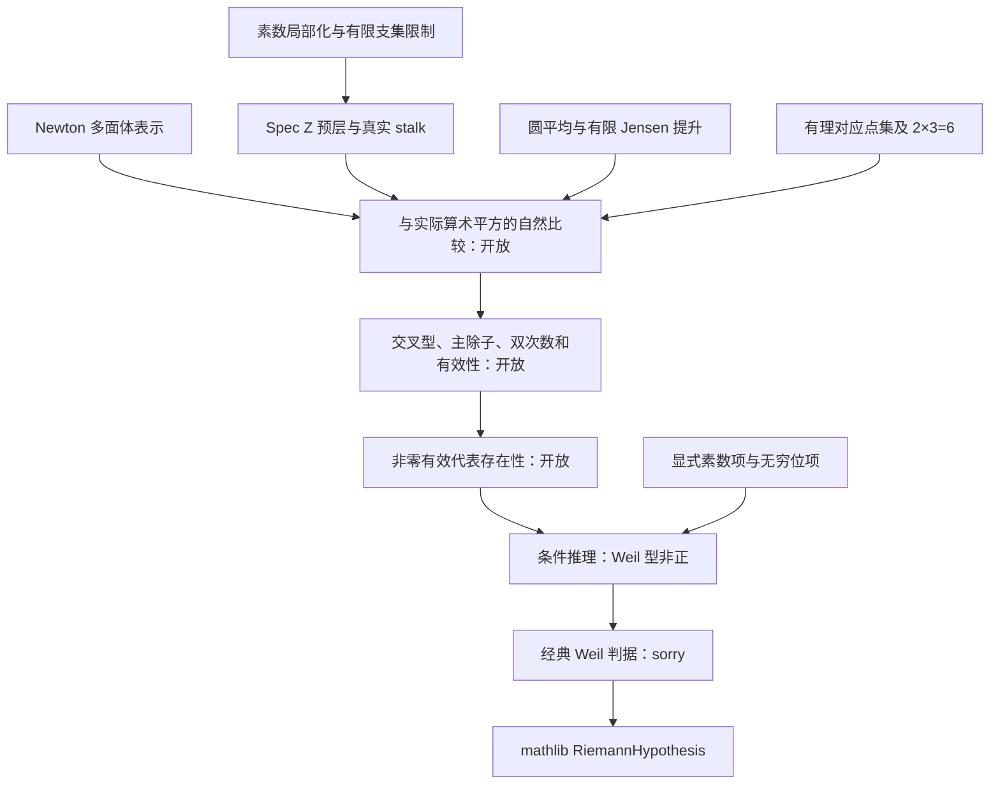

# 数学蓝图与缺口账本

状态含义：`proved` 是已写证明、待以构建和 axiom 输出共同验收；`classical_sorry`
是明确陈述而尚未在 Lean 证明的经典命题；`depends_on_sorry` 是证明正文完整但传递依赖含
`sorryAx`；`open_research_input` 是没有提供见证的研究条件；`planned` 尚未成为 Lean 声明。
任何 `sorry` 都不是可用于宣布数学突破的证据。

图中的开放箭头未由 Lean 提供见证；当前 `SquareModel` 只是最后几步的接口。

| 节点 | Lean 位置／声明 | 分类与下一证明 |
|---|---|---|
| ARITH-01 | `PrimeLocalization.lean`: `prime_scaling_surjective` | proved：非负 `ℤ[1/p]` 指数可除以 p |
| BP-ARITH-02 | `mem_primeLocalization_iff` | classical_sorry：子环闭包的分母正规形 |
| RESTRICT | `FiniteSupport.lean`: 四个限制映射引理 | proved：有限支集限制、自反与复合 |
| BP-SHEAF-01 | `exponentPresheaf_isSheaf` | classical_sorry：利用 Spec ℤ 的拟紧开集，把局部有限支集合并 |
| BP-SHEAF-02 | `exponent_stalk_at_prime` | classical_sorry：真实余极限 stalk 与局部指数锥的等价 |
| SHEAF-03 | 泛点 stalk、吸收元与球面代数比较 | planned：先作实际 pointed-monoid 层，再给自然比较，不能只匹配 stalk |
| RATIONAL-01 | `RationalCorrespondence.lean`: `parametrization_mem`, `two_three_six` | proved：单位复数点上的方程及复合；不是 scheme 同构 |
| RATIONAL-02 | Bézout 逆、覆盖次数、双圆平均 | planned：对正互素 m,n 证明逆与次数 n,m，再比较实际 Ψ(m/n) |
| BP-SQUARE-01 | `newtonEquivalent_iff_hull` | classical_sorry：有限整点集上 Newton 凸包的分离刻画，含空集 |
| SQUARE-02 | reduced Newton quotient 的运算及 site 比较 | planned：不是已完成的半环化 topos |
| BP-JENSEN-00 | `finiteLift_circleIntegrable` | classical_sorry：有限个零点／极点的对数局部可积 |
| BP-JENSEN-01 | `jensen_finite_lift` | classical_sorry：显式有限乘积逐因子圆平均 |
| BP-JENSEN-02 | `jensen_one_add_and_sub` | classical_sorry：`1±z` 的 Jensen 恒等式 |
| JENSEN-03 | `jensen_const_two`; `jensen_not_max_additive` | 前者 proved，后者 depends_on_sorry；禁止把圆平均当 max-plus 同态 |
| BP-JENSEN-04 | `finiteProfile_weakSecond` | classical_sorry：`∫F φ''=Σ n φ(a)`，不是折点处点态二阶导数 |
| BP-WEIL-00 | `weil_convergence` | classical_sorry：卷积积分、素数和、无穷位积分的收敛 |
| BP-WEIL-01 | `weilCriterion` | classical_sorry：固定算术型非正 iff 实际 ζ 的 RH，需完整经典显式公式证明 |
| EXIST-01 | `SquareModel`, `DegreeDescent`, `EffectiveRigidity`, `SectionExistence` | open_research_input：必须在实际算术几何对象上实现，不能用抽象包装冒充构造 |
| EXIST-02 | `nonpositive_of_existence` | proved 条件推理；未证明存在性前提 |
| EXIST-03 | `rh_of_existence` | depends_on_sorry，且仍含未验证的几何假设 |
| EXIST-04 | `BareExistenceProblem` | open_research_input，无见证；单独定义此命题不是存在性证明 |

## 关键约定

Jensen 坐标是 `x=-log|z|`；Weil 测试坐标是 `x=log u`。后者测试函数为实值
`C∞` 紧支集函数，零矩条件是 `∫f(x)dx=0` 和 `∫exp(x)f(x)dx=0`。
Lean 的 `open scoped ContDiff` 在本版本必需：`∞` 表示光滑阶，不能改成表示解析阶的 `⊤`。
次数命名遵循原文：`degreeMoment=∫exp(x)f(x)dx`，`codegreeMoment=∫f(x)dx`。
实际函数系数、von Mangoldt 项及 archimedean 项在 `Weil.lean` 中固定，不能通过选择零泛函获得结论。

有限 Jensen 乘积使用整数幂；负幂表示亚纯情形，不能标成全纯提升。
Lean 在零点处将运算全定义化，需证明这些有限角度不改变积分；圆可积命题单列。
将有限除子消去成零有效除子，不能满足 `SectionExistence` 的 `E≠0`。
有效除子的非零性也不能由“存在非零截面”自动推出。

`SquareModel` 用实向量空间作为条件接口，并未给它虚构 Banach 结构以作除子值积分。
构造 `arithmeticDivisor`、双线性交叉、主除子子空间和 trace identification 均属未完成的几何输入。
存在性假设以正自交为前提；条件证明显式经 `trace_identification` 从正 Weil 值转入几何前提。
这只检查逻辑接口，不证明 trace identification 的实际算术实现。

抽象包的存在性本身有完整 Weil 非正性的强度，不能当成较弱的 F₁ 框架存在命题。
数学上，在已知 Weil 非正时可取测试函数集上的自由实向量空间、基向量的对角配对为
`weilSelf`、主除子为零、有效集为 `{0}`，使存在性条件真空成立。
因此必须另加与实际算术平方的比较，才能排除这种无几何内容的模型；本轮不宣称已形式化该反向构造。

## 文献定位与推进顺序

原件全部在 [literature/f1](../../literature/f1/)，版本与下载链接见
[文献索引](../../literature/README.md#f1-20260909)。推导和页码核读见[363](../../notes/363-f1-arithmetic-geometry-and-existence-audit.md)。

1. 先补素数局部化正规形、sheaf gluing 与 stalk；再正式构造吸收元和自然比较。
2. 用 mathlib 的 `Real.circleAverage`、`circleAverage_log_norm_sub_const_eq_log_radius_add_posLog`
   证明有限 Jensen 引理，随后证明弱导数恒等式。对闭圆盘使用亚纯 Jensen 定理时须核实定义域假设。
3. 完成有理图的 Bézout 逆与次数，核对 Connes–Consani 2015 arXiv:1502.05580v1 的实际对应。
   Theorem 7.7 在两参数无理而乘积有理时有切向恒等变形，不能形式化成无例外的 Ψ 乘法律。
4. 2018 arXiv:1805.10501v1 §3 (12)–(14) 对应固定 Weil 型；把 log 坐标变换、收敛和经典判据补全。
5. 2023 arXiv:2306.00456v1 的环 ℤ RR、2026 arXiv:2602.15941v1 的 Picard 幺半群及
   arXiv:2606.06604v1 的 F₁ 曲线是比较来源；这些现有构造不能直接填入全局平方的 RR 缺口。
6. 最后针对实际算术平方尝试构造或存在性证明；允许更换本接口，但须提供具体算术比较定理，
   保留全局相容性及非零有效性。只有把这些研究条件变成实际定理才可能构成新数学进展。

Borger arXiv:0906.3146v1 的 Λ 下降、Lorscheid arXiv:1103.1745v2 的 blueprint
提供其他结构语言；这里没有宣称已形式化它们的全部理论。
